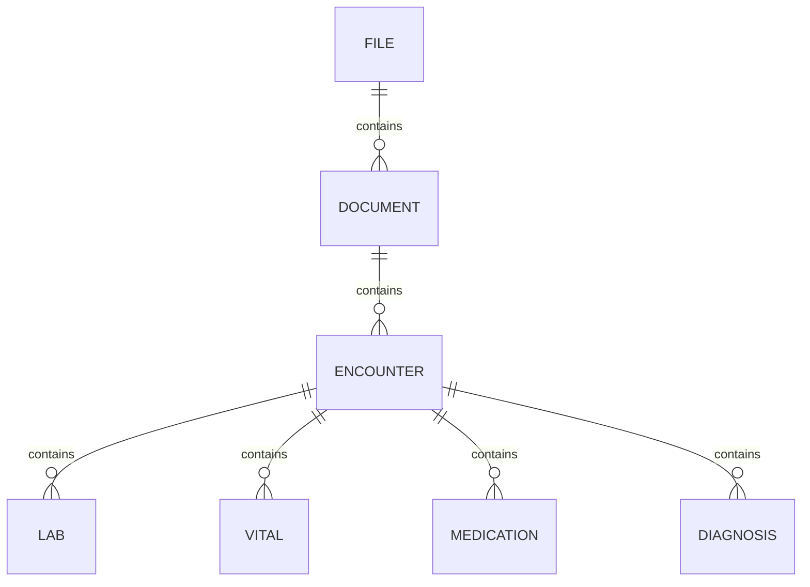

# Windows PostgreSQL 17 document benchmark

Run against PostgreSQL 17 installed locally on Windows 11. All commands use PowerShell and your existing PostgreSQL service. The default dataset contains **5,000,000 documents** and **92,500,000 total business rows**.

## One-command setup

With the PostgreSQL Windows service running, open PowerShell and run:

```powershell
cd C:\repos\sample-health-app
.\scripts\setup.ps1
```

The script prompts for your installation's `postgres` password, creates `docbench` if missing, creates tables in the default `public` schema, loads **5 million documents and their related rows**, builds indexes, and verifies counts. It finds Python bundled with pgAdmin automatically. Existing benchmark loads resume with matching parameters; conflicting objects are not overwritten. It restores your session's connection/password environment variables when finished. Measurements are a separate step.

Preview without connecting, or create a small separate database first:

```powershell
.\scripts\setup.ps1 -Plan
.\scripts\setup.ps1 -Database docbench_smoke -Documents 800 -BatchSize 200
```

Optional parameters: `-Port 5432`, `-UserName postgres`, `-PostgresBin 'C:\Program Files\PostgreSQL\17\bin'`, and `-PythonPath 'C:\path\to\python.exe'`. Use `-UseExistingAuthentication` to skip the password prompt and use your existing `PGPASSWORD` or password file; password-file authentication needs entries for both `postgres` (database creation) and the target database. The script uses the existing service and does not install or start PostgreSQL.

If Windows blocks local scripts, launch just this script with a process-scoped execution policy:

```powershell
powershell.exe -NoProfile -ExecutionPolicy Bypass -File .\scripts\setup.ps1
```

## Manual setup in PowerShell

Confirm the PostgreSQL service is running in Windows Services or with `Get-Service *postgres*`. Open PowerShell in this repository:

```powershell
cd C:\repos\sample-health-app
$env:PSQL = 'C:\Program Files\PostgreSQL\17\bin\psql.exe'
$env:PGHOST = '127.0.0.1'
$env:PGPORT = '5432'
$env:PGUSER = 'postgres'
$env:PGDATABASE = 'docbench'
# Use Python 3.10+; pgAdmin includes this runtime with the standard installer:
$python = 'C:\Program Files\PostgreSQL\17\pgAdmin 4\python\python.exe'
& $python --version
```

Adjust the executable paths and port to your installation. If pgAdmin's Python is absent, use an installed Python 3.10+ executable. No pip packages are required.

Create an empty benchmark database (the prompt asks for the PostgreSQL password you chose during installation):

```powershell
& $env:PSQL -X -h $env:PGHOST -p $env:PGPORT -U $env:PGUSER -d postgres -W -v ON_ERROR_STOP=1 -c 'CREATE DATABASE docbench;'
```

If the database already exists, inspect it before loading. The loader creates unqualified tables in `public` and refuses to overwrite conflicting objects. For another dataset, create a new empty database and change `$env:PGDATABASE`. There is no automatic database deletion or reset. The installation administrator is convenient for this local synthetic benchmark; an existing database owner account also works.

Authenticate repeated script connections using `%APPDATA%\postgresql\pgpass.conf`. Create the directory if needed and save a line like this (replace the password):

```text
127.0.0.1:5432:docbench:postgres:YOUR_INSTALLATION_PASSWORD
```

Save as `pgpass.conf`, not `.txt`, restrict access to your Windows account, and never commit it. Escape `:` and `\` in passwords with `\`. Alternatively, set a password for the current PowerShell session without putting it in command history:

```powershell
$credential = Get-Credential -UserName $env:PGUSER -Message 'Local PostgreSQL password'
$env:PGPASSWORD = $credential.GetNetworkCredential().Password
& $env:PSQL -X -w -h $env:PGHOST -p $env:PGPORT -U $env:PGUSER -d $env:PGDATABASE -c 'SELECT version(), current_database();'
```

Child processes inherit this variable. After use, clear it with `Remove-Item Env:PGPASSWORD`. Passwords saved in VS Code or pgAdmin do not automatically authenticate the scripts. See the [PostgreSQL password-file documentation](https://www.postgresql.org/docs/17/libpq-pgpass.html).

Preview counts, load, then measure after setup exits successfully:

```powershell
& $python scripts/setup.py --plan
& $python scripts/setup.py
& $python scripts/benchmark.py --repeats 10
```

The loader commits every 20,000 documents and their children. Re-run the same setup command after interruption: rows and progress commit together, and indexing/vacuum can resume. Keep the document count and batch size unchanged. A database advisory lock prevents concurrent loaders. Do not edit the data during loading or measurement.

For a smoke run, first create a **separate empty database** named `docbench_smoke` using the create command above with that name, then:

```powershell
$env:PGDATABASE = 'docbench_smoke'
& $python scripts/setup.py --documents 800 --batch-size 200
& $python scripts/benchmark.py --repeats 2
$env:PGDATABASE = 'docbench'
```

Add a password-file entry for the smoke database if using that method. Counts and batch sizes must be positive even numbers. Explicit synthetic IDs are supplied by the loader; they are not application identity sequences.

## Connect with VS Code's PostgreSQL extension

Install **PostgreSQL by Microsoft** (`ms-ossdata.vscode-pgsql`). Open its PostgreSQL view and choose **Add Connection** / the plus button. Use these settings:

| Setting | Value |
|---|---|
| Name | Local document benchmark |
| Server / host | `127.0.0.1` |
| Port | `5432` or your installation's port |
| Authentication | Password |
| User | `postgres` or your selected database owner |
| Password | Your local PostgreSQL account password |
| Database | `docbench` |
| SSL mode | `Prefer`; use `Require` only with a TLS-configured server |

Connect and select `docbench`. Refresh the explorer after loading; expand **Schemas → public → Tables**. Open [sql/03-queries.sql](sql/03-queries.sql), select a statement, and execute it against that connection. Remove `EXPLAIN` to display matching documents. Run setup and benchmark scripts from PowerShell.

See Microsoft's [connection instructions](https://learn.microsoft.com/en-us/azure/postgresql/development/vs-code-extension/connections).

## Connect with pgAdmin 4

1. Open pgAdmin. Right-click **Servers → Register → Server**. On **General**, name it `Local document benchmark`.
2. On **Connection**, enter host `127.0.0.1`, port `5432`, maintenance database `docbench`, username `postgres`, and your PostgreSQL password. Save the password if desired. Leave SSL mode at `Prefer` unless your installation needs another setting; recent versions expose it in connection parameters. Click **Save**.
3. Expand **Databases → docbench → Schemas → public → Tables**. Refresh if necessary.
4. Right-click `docbench` and choose **Query Tool**. Open [sql/03-queries.sql](sql/03-queries.sql) and execute a selected statement. For table previews, use **View/Edit Data → First 100 Rows**.

The pgAdmin master password, if requested, protects saved credentials and is separate from the database password. See the official [server dialog documentation](https://www.pgadmin.org/docs/pgadmin4/latest/server_dialog.html).

For connection refused errors, check the service and port. Authentication failures require the PostgreSQL account password. Missing tables usually mean the wrong database, incomplete setup, or an explorer that needs refreshing.

## Schema

All benchmark tables and the `confidence` domain live in PostgreSQL's default `public` schema. Application queries use plain names such as `SELECT * FROM document;` and `SELECT * FROM file;`. No custom schemas are created. The Python scripts explicitly select `public` for each connection, and the PowerShell setup configures it as the database's default search path for new connections. If your SQL client or role overrides that setting, run `SET search_path TO public;` in that session.

This layout requires a fresh database; it does not migrate an earlier layout. The document count, relationships and confidence rules are unchanged.



[sql/01-schema.sql](sql/01-schema.sql) defines non-null parent foreign keys. Each child belongs to exactly one parent; a parent may have zero or more children. Labs, vitals, medications and diagnoses reach documents through encounters and do not duplicate `document_id`.

Every parsed non-key attribute has an adjacent `<attribute>_conf`: member fields, document type, provider fields, encounter attributes, laboratory results, vital measurements, medication attributes and diagnosis attributes. Extracted `member_id` is text, not a foreign key. Exceptions are primary/foreign keys, system-generated file URI/ingestion timestamp, and loader checkpoint metadata because those are not AI observations. Unrelated parse-run and editing/audit infrastructure is omitted.

Confidence is a shared `numeric(3,2)` domain constrained to **0.00–1.00 inclusive**. NULL means unknown and does not pass numeric thresholds. PostgreSQL rounds to two decimals before the domain check; validate original parser output before conversion. A score of `0.65` does not pass `> 0.65`. Value and confidence can independently be NULL: a parser may assess confidence in an absent value. No PDF parser is included.

## Dataset and storage

| Table | Default rows | Fanout |
|---|---:|---|
| `file` | 2,500,000 | 2 documents per file |
| `document` | 5,000,000 | 2 encounters per document |
| `encounter` | 10,000,000 | Parent of clinical observations |
| `lab` | 20,000,000 | 2 per encounter |
| `vital` | 20,000,000 | 2 per encounter |
| `medication` | 15,000,000 | 1 for odd encounters; 2 for even encounters |
| `diagnosis` | 20,000,000 | 2 per encounter |
| **Total business rows** | **92,500,000** | Plus one loader checkpoint |

Deterministic arithmetic generates the same values for the same IDs regardless of batch size. Simvastatin occurs in 10% of medication rows, and E11.9 in 12% of diagnosis rows. Patterns have artificial correlations and fixed fanout; they do not model clinical prevalence or parser calibration. PDF binaries, document bodies and raw parser JSON are excluded.

The full dataset needs substantial disk space for 92.5M rows, indexes, WAL and index-build temporary files. Full-scale storage and runtime have not been measured. Use the smoke load and a larger pilot to estimate table/index storage and leave extra space for WAL and temporary work. As the installation administrator, `SHOW data_directory;` identifies the drive to check. Server memory/durability settings are unchanged. Loading may take considerable time; monitor the console or `SELECT * FROM benchmark_state;` for committed progress.

## Queries and measurements

Searches return documents where a diagnosis above the confidence threshold and simvastatin occur in the **same encounter**. Nested `EXISTS` prevents duplicate documents and child-row multiplication. The six scenarios are full count, first 50 documents, a page after 90% of document IDs, high confidence, a rare code, and a nonexistent code. Labs/vitals are loaded, indexed and verified but are not search filters in these scenarios.

[sql/02-indexes.sql](sql/02-indexes.sql) indexes parent foreign keys, member lookup, diagnosis code/confidence, and medication name/encounter. After loading, setup builds indexes, runs `VACUUM ANALYZE`, checks exact table counts, and samples encounter fanout across the ID range. Foreign keys enforce referential integrity on every inserted row.

Each measurement run creates a timestamped directory under ignored `results/`, with `environment.json` (counts, settings, storage), `summary.csv`, `samples.json`, and JSON execution plans. No results are prefilled. One warm-up precedes measured sequential repetitions of each query. Server execution times exclude process startup, transfer and UI rendering. Ten samples give only a descriptive p95. These are local warm-cache measurements, not cold-cache or concurrent throughput measurements or production sizing guarantees. See [PostgreSQL EXPLAIN](https://www.postgresql.org/docs/17/using-explain.html).

## Developer verification

```powershell
& $python -m unittest discover -s scripts -p 'test_*.py'
# Point PGDATABASE at a separate EMPTY test database first:
& $python scripts/test_integration.py
```

Integration checks require an empty `public` schema, load a small fixture, check constraints and resume behavior, and remove only their own tables and confidence domain on success. They preserve the `public` schema. Use a dedicated test database.
