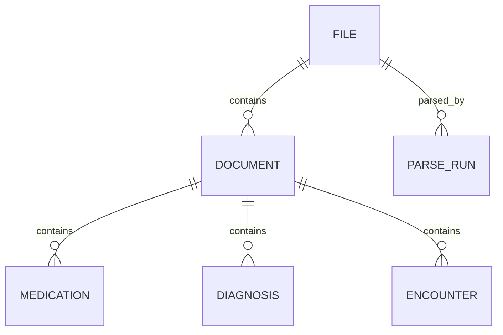

# PostgreSQL document query benchmark

For the new **5 million documents** dataset with 15M medications, 20M diagnoses and 10M encounters, see [LARGE-BENCHMARK.md](LARGE-BENCHMARK.md). The original smaller benchmark and its historical measurements remain documented below.

Use relational child tables with confidence columns beside each extracted value. For the requested diagnosis-code + confidence predicate, this supports a single compound index and avoids joining each diagnosis to its confidence. This is a workload-based recommendation, not a universal promise; the included comparison measures a typed, separate confidence-table design on identical data.

## Start in Ubuntu / WSL

Docker Engine and the Compose plugin must be installed. If needed, `sudo bash scripts/install-docker.sh` installs them from Docker's official Ubuntu repository. Docker Desktop with Ubuntu WSL integration also works; do not install a second engine if you already use Desktop.

```bash
cd /mnt/c/repos/sample-health-app
sudo bash scripts/setup.sh
sudo bash scripts/benchmark.sh 10
```

Omit `sudo` when your user already has Docker access. Scripts require Bash and Python 3. The image is PostgreSQL 17, an Azure Flexible Server supported major version. The image tag receives minor updates; results/environment.json records the tested server version and image ID. Pin an image digest for repeatable comparisons over time.

The default is **1,000,000 business rows**: 100,000 files, 200,000 documents, 300,000 medications, 300,000 diagnoses, and 100,000 encounters. The optional `separated` comparison adds 1,200,000 rows. Parse runs and edit audit begin empty. Data is synthetic and generated with a fixed random seed. Names, codes and NPIs are test labels, not clinical reference data.

To test **1,000,000 documents / 5,000,000 business rows**, use a new Compose project (separate database volume):

```bash
sudo env COMPOSE_PROJECT_NAME=docbench-large bash scripts/setup.sh 1000000
```

Stop the original container first (`sudo docker compose stop`) because both use port 55432. Use the same COMPOSE_PROJECT_NAME on all later commands for the large instance. Setup refuses to reseed an existing schema. It does not repair a partially failed load; inspect the failure and use a new project/volume for a fresh attempt. Counts must be multiples of four to preserve exact totals.

```bash
sudo docker compose stop           # preserve data
sudo docker compose up -d --wait   # resume
sudo docker compose logs db       # startup diagnostics
```

No automatic volume deletion or reseeding is performed. PostgreSQL data lives in a Docker named volume in Linux; SQL files are mounted read-only from this directory. Durability settings remain enabled. The supplied password is for this local synthetic benchmark only; the exposed port binds to loopback.

## Connect from the Microsoft PostgreSQL extension in VS Code

Add a PostgreSQL connection with these settings:

| Setting | Value |
|---|---|
| Server / host | `127.0.0.1` |
| Port | `55432` |
| Database | `docbench` |
| Authentication | Password |
| User | `bench` |
| Password | `local-bench-only` |
| SSL mode | Disable (local container has no TLS configured) |

Open `sql/05-queries.sql`, select a statement and execute it. These are plain SQL; the setup/verification files contain psql commands and should be run by the shell scripts. Remove the EXPLAIN line to retrieve actual matching documents. The count query measures the whole match set; the paged query measures the first 50. Test later pages with `d.id > last_seen_id` as well.

Windows normally forwards localhost to WSL. If your configuration does not, use VS Code attached to Ubuntu through Remote–WSL and connect there to localhost:55432. Keep the container loopback binding. Azure connections instead need their actual endpoint and TLS settings.

## Model and confidence decisions



- `ingest.file`: immutable blob URI + version identify a source. Multiple document rows reference a file.
- `ingest.parse_run`: unique pipeline idempotency key, model version, and URI to immutable raw JSON. A composite foreign key ensures a document's run belongs to its file. Synthetic documents omit parse runs to keep the core row count clear.
- `clinical.document`: extracted member identifier/names and provider name/NPI. These are observations from a document. Do not use uncertain AI identifiers as foreign keys to a canonical member/provider master. Add separately resolved master IDs later, preserving extracted text and its confidence. Here “member” is interpreted as the member fields listed; add another value/confidence pair if it denotes an independent attribute.
- Child tables: one row per extracted medication, diagnosis, or encounter, not arrays or repeated columns. `source_item_key` is pipeline metadata rather than an AI attribute. Unique parent/source keys provide stable item identity.
- Every modeled extracted attribute has a sibling `_conf`. Structural IDs, version counters, timestamps and ingestion metadata do not. Confidence is `numeric(5,4)` constrained to [0,1]; NULL means unknown/not supplied and does not pass `> 0.65`. Four decimals avoid rounding all AI output to two decimals. Validate original JSON before numeric conversion because declared precision rounds on assignment. If actual scores need more precision, widen the type. `real` saves space but has approximate boundaries; scaled integers are another option when score resolution is fixed.
- Medication name equality is exact and case-sensitive. Establish a canonical search key or medication coding system if equivalent names/case must match, while retaining raw extraction. Diagnosis code system is stored; include it in production predicates/indexes if multiple systems coexist. This seed uses one system.

The alternate `separated` schema splits medication/diagnosis confidence into typed one-to-one tables keyed by the child ID. It includes foreign keys and comparable lookup indexes. It shares document parents and is an immutable comparison snapshot, not a synchronized alternative application model. There is no inherent normalization requirement to split confidence: both value and score depend on the same entity row. A generic `(entity_type, entity_id, attribute_name, confidence)` table usually adds rows, joins, and harder referential integrity. It may help highly dynamic attributes, but is not the recommended hot query path here.

Use JSONB or immutable blob JSON for raw output and infrequently queried evolving fields; project frequently filtered attributes into typed columns. Do not store only the full response in JSONB and expect this relational benchmark's timings. A very wide, sparse document model can warrant vertical splitting of cold fields, measured against actual reads.

## Query and index design

The two EXISTS predicates mean “at least one matching diagnosis and at least one matching medication in the same document.” They do not require a clinical linkage or the same encounter. Both diagnosis code and confidence are checked on the **same diagnosis row**. This avoids document duplication and the child-row multiplication of joining all three child tables at once.

The initial diagnosis index is `(diagnosis_code, diagnosis_code_conf) INCLUDE(document_id)`; medication uses `(medication_name, document_id)`. Existing unique parent/source-key indexes support child lookup by document, and document lookup by file. A member index supports exact member lookup. These are starting indexes, not an instruction to index every field/confidence pair.

For highly selective filters the planner can start at the diagnosis index; for paged searches it may scan ordered documents and probe child rows. Inspect the actual plans. If late pages need too many probes, test a document-leading index such as `(document_id, diagnosis_code, diagnosis_code_conf)` against its added write/storage cost. A partial index at a fixed confidence threshold can help a fixed workflow, but is less flexible for arbitrary thresholds and parameterized plans. Do not partition merely because there are a million rows; introduce partitioning only for useful pruning or lifecycle requirements. Tenant filtering, if applicable, must be added consistently to keys, predicates, and indexes before production use.

## Pipeline and editing

Batch JSON mapping in the pipeline; use COPY into staging tables and then transactional INSERT/UPSERT into the typed model for large loads. Create a parse_run using the source version + processing identifier as an idempotency key, insert documents and children within a transaction, and acknowledge completion only after commit. Repeating an idempotency key should return the existing run, not reapply it. The benchmark supplies the schema, not a service-specific JSON mapper.

Raw JSON should be immutable and retain original model confidence. An AI score of 1 and a human-confirmed value both satisfy the requested effective-confidence convention, so confidence alone is not provenance. `audit.edit` preserves actor, before/after values and scores for human UPDATEs. `sql/07-edit-example.sql` demonstrates transaction-local actor tagging, automatic confidence=1 for changed attributes, and optimistic version checking. Explicitly set `_conf=1` to confirm an unchanged field. Human clearing of a value also gets confidence=1, meaning the absence was confirmed. The example rolls back.

Only a trusted backend may assign `app.actor`; the setting is not authentication. The benchmark connection is an administrative role for testing, not a production authorization model. Production needs constrained API roles, authenticated actor propagation, and protected audit writes. Direct inserts are treated as pipeline inserts; human-created rows must explicitly supply confirmed scores through their API. Do not allow parser reruns to overwrite reviewed values: ingest reruns as new observations and reconcile them using explicit per-field review state or an override table. The trigger alone is not a rerun merge policy. Preserve review state separately from confidence; model confidence may also be 1.

## Measure and interpret

`benchmark.sh` checks identical results, warms each query, alternates layout order, then captures repeated server execution timings for common count, first page, high confidence, rare code, and no match. It saves CSV timings, JSON query plans with buffers, version/settings, and table/index sizes under `results/`. All tests run sequentially with one client; this is not a concurrent throughput test. p95 from ten samples is descriptive and too small for an SLO claim. Increase repetitions and add a production-shaped concurrent load before sizing Azure.

`EXPLAIN ANALYZE` runs the query but does not include transferring/rendering all result rows in the application. The recorded times exclude launching psql and Docker. Buffer hits versus reads, heap fetches, spill/sort behavior and estimated versus actual rows explain differences. VACUUM ANALYZE after seeding permits index-only scans; frequent edits and ingest can change that. Warm-cache tests are not cold-cache tests, and restarting a container does not clear the Linux filesystem cache.

This seed varies fanout and independently draws medication/diagnosis labels; fanout itself follows a simple deterministic pattern, confidence is uniform, and there are no large document bodies. Real distributions may be skewed and diagnoses/medications correlated. Validate with realistic row widths, confidence distribution, tenant size, selectivity, concurrent writes, and late-page access. WSL results are comparative local evidence, not Azure latency estimates. Re-run on the target Azure tier/storage with the same PostgreSQL major, settings and indexes, and measure end-to-end application latency.

## References

- [PostgreSQL multicolumn indexes](https://www.postgresql.org/docs/17/indexes-multicolumn.html)
- [PostgreSQL EXPLAIN](https://www.postgresql.org/docs/17/using-explain.html)
- [Azure supported PostgreSQL versions](https://learn.microsoft.com/en-us/azure/postgresql/configure-maintain/concepts-supported-versions)
- [Docker Engine installation on Ubuntu](https://docs.docker.com/engine/install/ubuntu/)
